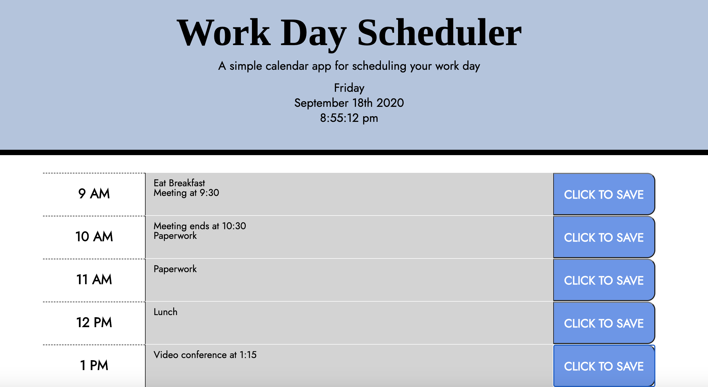

# Work Day Scheduler
> This app utilizes Moment.js, JavaScript, and jQuery in order to create an interactive calendar app where users can list and store events throughout the workday. Using this app, users can check whether the current time is before, after, or during the current hour, and use the save buttons to log their events into localStorage.

## General Info

This application is an interactive calendar app that keeps track of the hours of the current day from 9 to 5. When users open the app, they can view the weekday, date, and time in the header. Each row within the app represents one hour, and the colors of the rows correspond with the current hour of the day. If the text area within the row is gray, that means the hour displayed was before the current hour. If the current hour corresponds to one of the hours in the workday, the text area of the row will be red. The rows showing hours that will take place after the current hour is over will be green. This color scheme will make it easier for the user to tell if something takes place in the past, present, or future.

Users can input their work day schedules and events within the text areas. When the blue Save button is clicked, the text will be stored within the rows even when the page is refreshed. This will be convenient if users need to shut down their computer or navigate to a separate page, as their events will remain on the page if they navigate to the application later.

You can use the app yourself at https://mwaslick.github.io/work-day-scheduler/ !

## Screenshots

Example Schedule

## Special Thanks

Special thanks to UW Coding Bootcamp for being so willing to help with jQuery and localStorage!
